# Concept
- recréé des mini-jeux en s'inspirant de jeux nostalgique notamment Space Invaders. Ça aurait un design et des capacitées propres à notre création, tout en gardant l'idéologie du jeu nostalgique de base.

- L'originalité du projet proviens de la façons d'y jouer. Nous entrainerons les gens a jouer à ces minijeux autrement que avec leurs pouces et assis sur une chaise confortable. Ils devront mériter leurs scores par un certain exercice physique! Ils devront bouger un trigger de gauche a droite plutôt qu'un joystick. 

# Descriptions

# Moodboard

Pour créer une ambiance rétro, nous allons décorer non seulement notre design web avec ces bandes colorées et circulaires emblématiques des années 60 et 70, mais également nos éléments physiques, comme la table des contrôleurs. Ces motifs apporteront une touche vintage cohérente et immersive, reliant harmonieusement le monde numérique et l’espace physique.

---

## Container 1
<table>
  <tr>
    <td>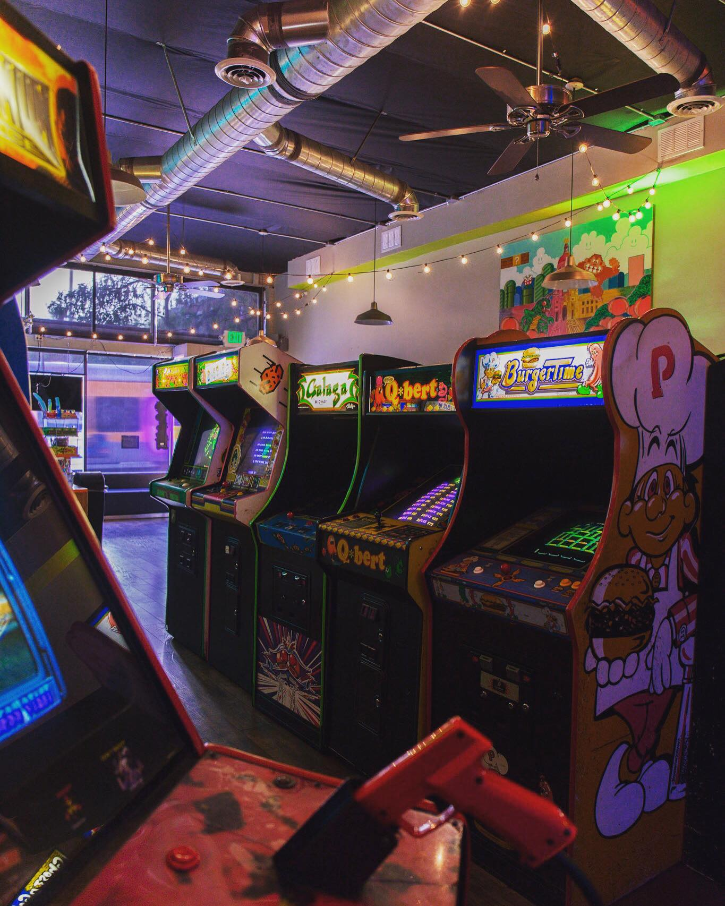</td>
    <td>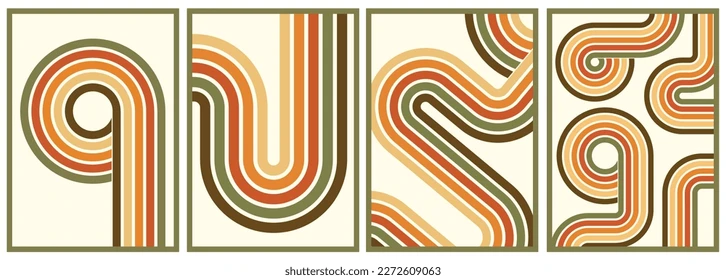</td>
    <td></td>
    <td></td>
  </tr>
</table>

---

## Container 2
<table>
  <tr>
    <td>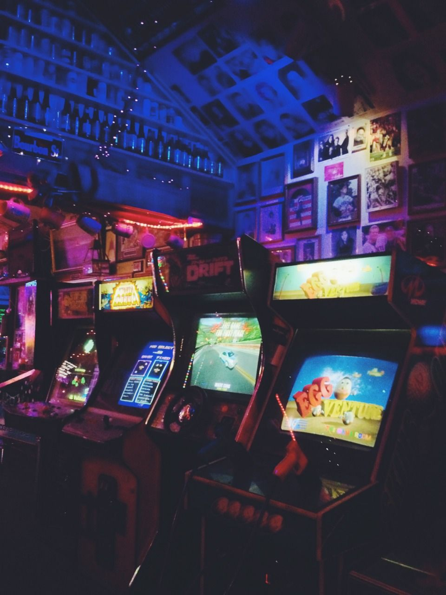</td>
    <td></td>
  </tr>
</table>

---

## Container 3
<table>
  <tr>
    <td>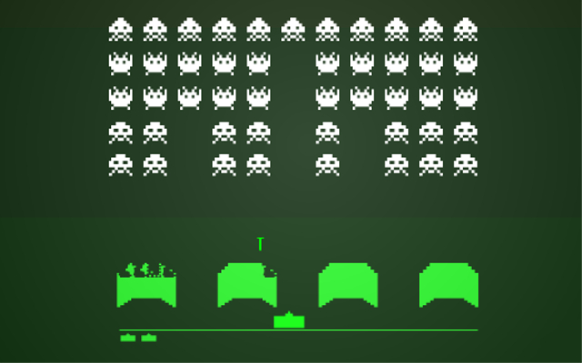</td>
    <td>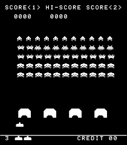</td>
  </tr>
</table>

# Jeux

L’aspect le plus visible de notre projet sera le ou les jeux auxquels chaque visiteur pourra jouer grâce à notre installation unique. Nous souhaitons recréer une ambiance qui ne semblerait pas déplacée dans une salle d’arcade d’il y a 30 ans, c’est pourquoi la nostalgie sera un élément clé. Nous recréerons des jeux similaires aux classiques tels que Space Invaders et Super Mario, en les développant à l’aide d’outils web comme Java, afin de capturer l’expérience de jeu typique d’une arcade, tout en intégrant les avancées technologiques de notre époque.

# Scénarimage
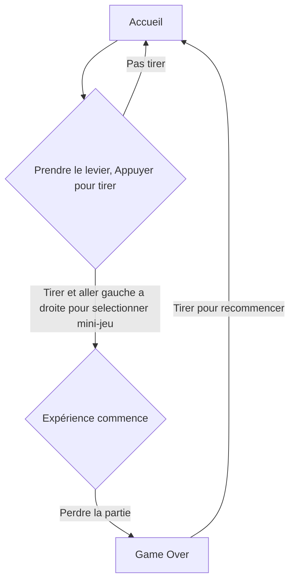
# Simulation
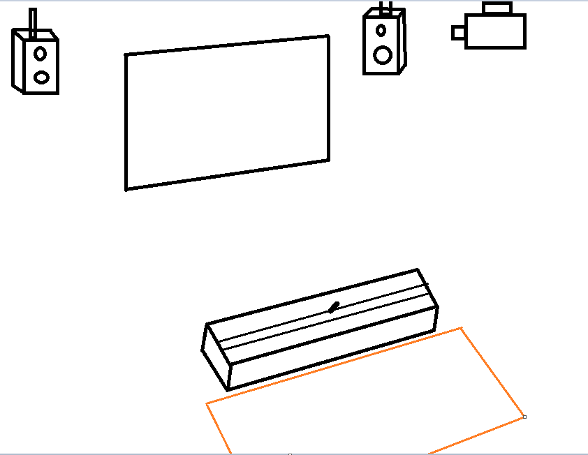
# Synoptique
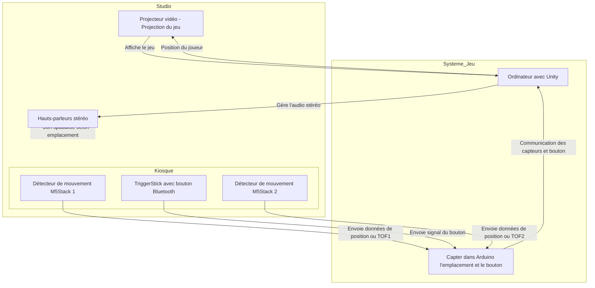
# Branchement

# Logiciels/Réseaux
### Logiciels:
* VsCode
* PlugData
* Arduino
* Maya/AfterEffect
* VCV Rack
### Réseautage:
Arduino communique grâce à une communication OSC vers Unity dans l'ordinateur. Unity générera le son transmis au travers les speakers et la projection sera celle que Unity génerera grâce à l'OSC.
 
Les Time Of Flights envoyeront des données pour calculé l'emplacement du vaisseau mère.
# Plantation

 
Studio T.I.M Montmorency
# Matériel
*  1 x Installation interactive
* Projecteur vidéo
* Ordinateur (Arduino & Unity avec Plugdata comme osc communication)
* Stock M5Stack
    - 1 Mechanical key [Bluetooth version]
    - 2 TOF ou 3 PIR M5Stack
* Kiosque prisme rectangulaire
* 2 Haut-parleurs
* TriggerStick
* Extrusion alluminium
 
### Rail Linéaire
Pour déplacer le trigger de gauche à droite

[Documentation](https://www.amazon.fr/OrangeA-HSR15X1500-Rectifieuse-limpression-industrielles/dp/B06VVXT19J)
 
### Etude Projecteur

 
Servira à projeter l'expérience sur une étandue élevé. Placé pas trop loin pour éviter une pollution visuels des pixels.
[DOCUMENTATION](https://www.bureauengros.com/products/3094403-fr-optoma-technology-4k400stx-projecteur-dlp-4k-uhd-a-courte-focale-4-000-lumens)
 
### Etude Kiosque
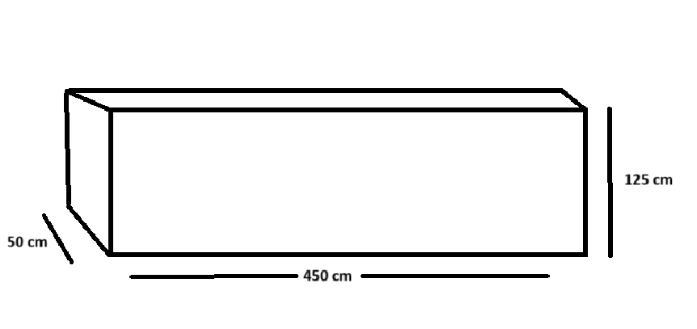
 
Servira à l'interactivité. C'est l'endroit ou le joueur pourra intéragir avec l'expérience en tant que telle. Ce kiosque sera aménagé avec tout les matériels pour le bon fonctionnement de l'expérience.
### American DJ
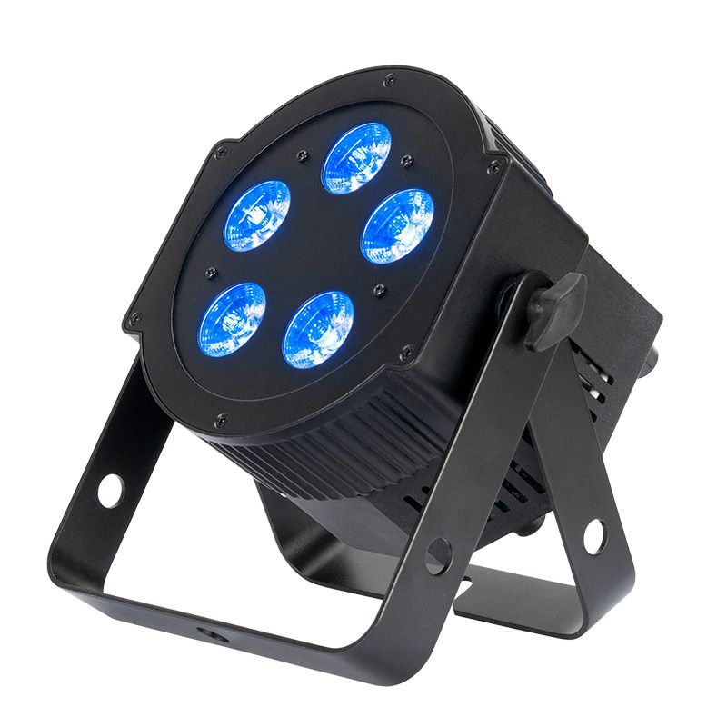
 
Lumière directement visé sur le kiosque tout en évitant tout intensité trop élevé. Accorde une luminosité minimale pour intéragir avec l'expérience.
[DOCUMENTATION](https://www.adj.com/5px-hex)
### Etude Equipement M5Stack
#### Etude Bouton
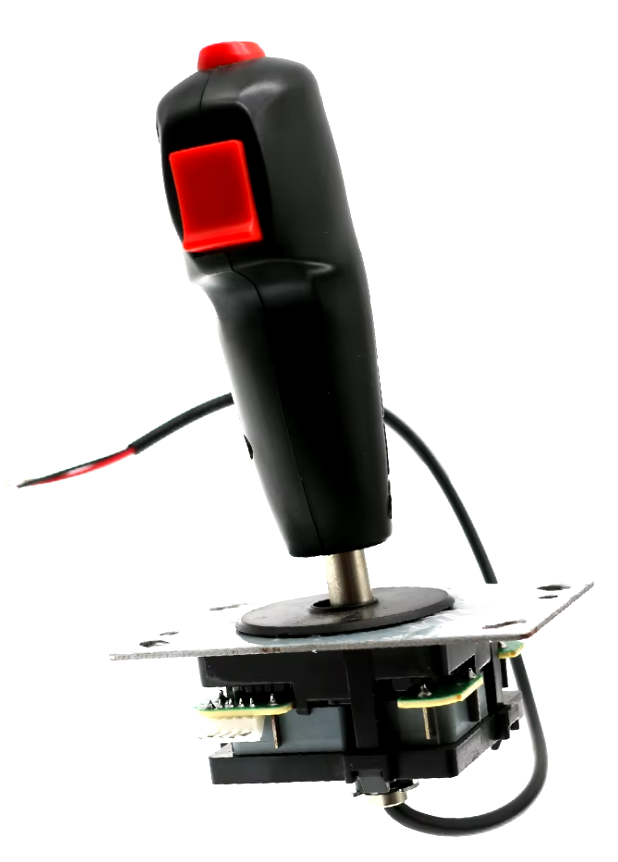
 
Batton avec bouton pour tirer. il est une visualisation de ce que je veux reproduire. Le batton sera toutefois fait à la main et ressemblera bien plus à ça :
 
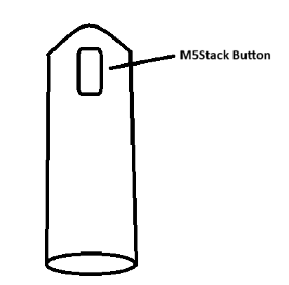
#### Etude TOF

 
Le "Time of Flight" de M5Stack sera utilisé pour détecter l'emplacement du levier.
 
[DOCUMENTATION](https://eu.mouser.com/new/m5stack/m5stack-tof-distance-sensor/)
#### Etude Key Unit
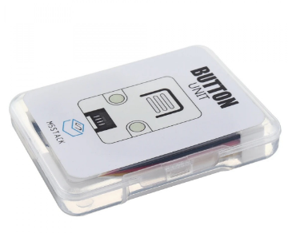
 
Placé directement sur le triggerstick, il sera le bouton bluetooth qui communiquera avec Arduino. À l'action, il enverra un message comme expliqué dans le synoptique. [OSC]
[DOCUMENTATION](https://www.tinytronics.nl/en/switches/manual-switches/push-buttons-and-switches/m5stack-button-unit)
 
### Etude Speaker

 
Positionner sur le plafond du studio.
 
[DOCUMENTATION](https://www.genelec.com/8040b)
 
### Etude Câbles
* Câble XLR 3pines
 
 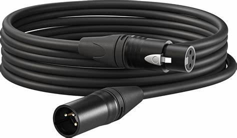
[Acheter Amazon](https://www.amazon.ca/AmazonBasics-C%C3%A2ble-microphone-m%C3%A2le-femelle/dp/B01JNLTTKS/ref=sr_1_1_ffob_sspa?dib=eyJ2IjoiMSJ9.Qc7Bm99GBP3_XdgZcQz45tvwI3ZqROZzvEu4V-F-QT388d0dx-YLODgUtsRmCb0TR1FPGUPEwhox88PlZm-JDHYXqmpN1VxeKf3W5k1g5NU1RZ2TFPbPHEgvEOSrXuJr0p9KFPer01MgBdV8xSHpXD5YZ1GfRCRcvu-F_YgfHtW0nnIjJADUKZ3dbmYpX97Y90rhmCpxBn37eHkWwjjazddP0l0gZG9GyMqQk0WBrxC5mV0aQjAITQ2gDr7Wvfz22xvF73O-EgQPh9p3sYhI7UYglNw0inOt6GjZYTSyBVE.dWFeMSa3GcqU8O-ySO4vj7Pt5r6aBAjf_mexNg1_OKA&dib_tag=se&hvadid=208379556679&hvdev=c&hvlocphy=9000598&hvnetw=g&hvqmt=e&hvrand=5867566891861396795&hvtargid=kwd-299658550019&hydadcr=5480_9838916&keywords=cable%2Bxlr&qid=1730664946&sr=8-1-spons&sp_csd=d2lkZ2V0TmFtZT1zcF9hdGY&th=1 )
 
* Câble XLR vers USB 3pines
 
 
[Acheter Amazon](https://www.amazon.ca/femelle-microphone-adaptateur-instruments-enregistrement/dp/B07WR14TYX/ref=sr_1_4_sspa?__mk_fr_CA=%C3%85M%C3%85%C5%BD%C3%95%C3%91&crid=2IOWF3QHGFSZN&dib=eyJ2IjoiMSJ9.dQGpMpgA9Iulza1HVu-XlK5gRTuLdXG4dKc3tbkKYKA-jMTHiCHNEq1TxnnkXODERf6h6RV-d2g33HtukI6CtW-rpr89U-fAFdxlsNMZ4OfGr21F6ud2zMlh0LZVeyRD0NEMft_wn6JiwvrKmUaYTlQTdfAbuoZpqtVW8t33pGZMe2eCrpvzHhdHhy04AVP7s8HqiZ-ufZRq5aGKWQAI3qPhduy1nDt4jcRi3K5roeoHq32kwXn4Mz8g2hQ1RTwyvAErp7RcdgnHTD0Kfsecbc5vVrnb_O79Sg42bqguw1c.Nf0Li0DKLt-J9auJCgwXc5akNUq49SsF3rtb7SSuqas&dib_tag=se&keywords=cable+xlr+usb&qid=1730665110&sprefix=cable+xlr+usb%2Caps%2C83&sr=8-4-spons&sp_csd=d2lkZ2V0TmFtZT1zcF9hdGY&psc=1)
 
 * Barre Multi-prise
 
 
 
 [Acheter Amazon](https://www.amazon.ca/-/fr/Multiprise-interrupteurs-individuels-multiprise-rallonge/dp/B08617QZN5)
 
# Visiteur & Sécurité
Les visiteurs auront une zone auquel il ne pourront pas traverser si un autre visiteur est dans cette zone. Limitant tout risque de contact et risque de blessure.
 
Le TriggerStick aura un feutre dessus pour éviter tout blessure au main d'un coup que le déplacement "JAM" d'un coup-sec. Un feutre& ou un ressort épais amortissera aussi le méchanisme de mouvement s'il est poussé aux rebords.
# Cablage
Étant donné que l'installation est dans le studio, le stock peut être caché dans le kiosque. Les prises dans le sol permettent de cacher les fils et pour ceux du projecteur et et speakers au plafond, il sera simple de placer les fils pour qu'ils longent un mur inutilisé.
 

# Médiagraphie
 
 
# Moodboard
 
# Jeux
 
L’aspect le plus visible de notre projet sera le ou les jeux auxquels chaque visiteur pourra jouer grâce à notre installation unique. Nous souhaitons recréer une ambiance qui ne semblerait pas déplacée dans une salle d’arcade d’il y a 30 ans, c’est pourquoi la nostalgie sera un élément clé. Nous recréerons des jeux similaires aux classiques tels que Space Invaders et Super Mario, en les développant à l’aide d’outils web comme Java, afin de capturer l’expérience de jeu typique d’une arcade, tout en intégrant les avancées technologiques de notre époque.
 
<table>
  <tr>
    <td>
    <td></td>
  </tr>
</table>
 

# Odyssee Mecanique IDÉE
 
Bloc note PROJET FINAL gestion projet Multimédia

	Barre de métal --> 4m => 2m30 plutôt
	Collant sur la boîte --> William design et collant à imprimer au dimension de la boîte
	Designer des néons pour l'idée artistique du projet => nostalgie & idéologie ancienne
	Recréation artistique original => Space Invaders redesign
	

	Créé des sons (VCV Rack I guess)[Musique: Menu & Jeux individuelles]
	Soundeffect (appui bouton & projectile touche ennemi & perte de vie)
	Arduino (TOF programmation des distances avec les functions qui oublient les données abérrantes)
	
	
	
	https://isaacfaf.github.io/planification/#/ 
