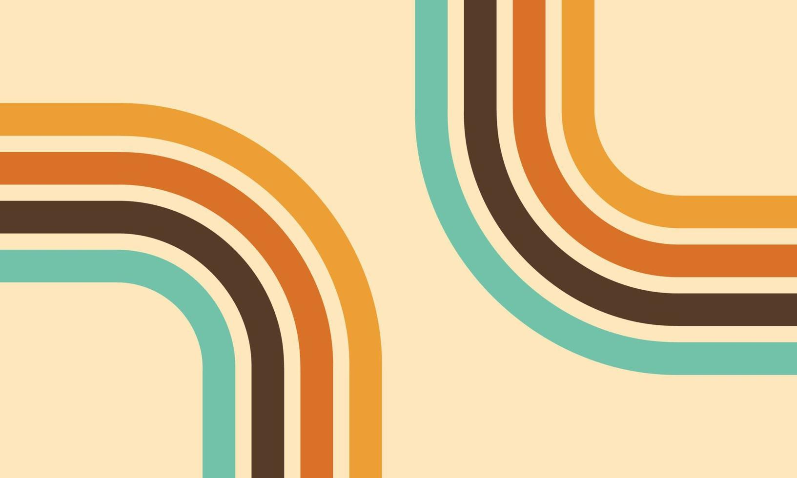

# Concept
- recréé des mini-jeux en s'inspirant de jeux nostalgique notamment Space Invaders. Ça aurait un design et des capacitées propres à notre création, tout en gardant l'idéologie du jeu nostalgique de base.

- L'originalité du projet proviens de la façons d'y jouer. Nous entrainerons les gens a jouer à ces minijeux autrement que avec leurs pouces et assis sur une chaise confortable. Ils devront mériter leurs scores par un certain exercice physique! Ils devront bouger un trigger de gauche a droite plutôt qu'un joystick. 

# Descriptions

# Moodboard

# Jeux

L’aspect le plus visible de notre projet sera le ou les jeux auxquels chaque visiteur pourra jouer grâce à notre installation unique. Nous souhaitons recréer une ambiance qui ne semblerait pas déplacée dans une salle d’arcade d’il y a 30 ans, c’est pourquoi la nostalgie sera un élément clé. Nous recréerons des jeux similaires aux classiques tels que Space Invaders et Super Mario, en les développant à l’aide d’outils web comme Java, afin de capturer l’expérience de jeu typique d’une arcade, tout en intégrant les avancées technologiques de notre époque.

<table>
  <tr>
    <td>

  </tr>
</table>
<table>
  <tr>
<td></td>
  </tr>
</table>

# Odyssee Mecanique IDÉE
 
Bloc note PROJET FINAL gestion projet Multimédia

	Barre de métal --> 4m => 2m30 plutôt
	Collant sur la boîte --> William design et collant à imprimer au dimension de la boîte
	Designer des néons pour l'idée artistique du projet => nostalgie & idéologie ancienne
	Recréation artistique original => Space Invaders redesign
	

	Créé des sons (VCV Rack I guess)[Musique: Menu & Jeux individuelles]
	Soundeffect (appui bouton & projectile touche ennemi & perte de vie)
	Arduino (TOF programmation des distances avec les functions qui oublient les données abérrantes)
	
	
	
	https://isaacfaf.github.io/planification/#/ 
