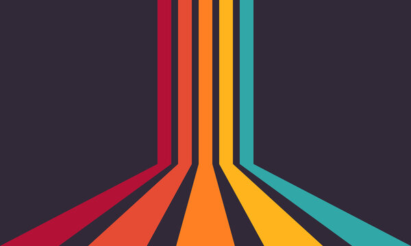

# Concept
Odyssée Mécanique revisite les classiques des jeux vidéo des années 70 et 80 en introduisant un concept innovant qui allie nostalgie et activité physique. Inspiré par des jeux iconiques comme Space Invaders, nous recréons des mini-jeux avec des mécaniques de gameplay adaptées à l'époque mais intégrant une dimension active. L’objectif n’est pas seulement de battre des scores, mais de faire en sorte que les joueurs s’entraînent physiquement pour mériter leurs performances.

Au lieu de jouer confortablement assis avec un joystick, les joueurs interagiront physiquement avec un "trigger" qu'ils devront déplacer de gauche à droite, imitant le mouvement de jeu classique de manière dynamique. Ce trigger peut être un capteur ou un dispositif à manœuvrer avec le corps, activant une série d'animations ou de mécaniques de jeu. Par exemple, pour Space Invaders, le joueur devra se déplacer sur une plateforme et "tirer" en bougeant son corps de manière précise, simulant l’action d’abattre les vaisseaux ennemis.

# Moodboard

Pour créer une ambiance rétro, nous allons décorer non seulement notre design web avec ces bandes colorées et circulaires emblématiques des années 60 et 70, mais également nos éléments physiques, comme la table des contrôleurs. Ces motifs apporteront une touche vintage cohérente et immersive.

---

## 1: Ambiance des Arcades des années 70 et 80
Dans ce projet, nous allons recréer une ambiance inspirée des arcades des années 70 et 80. Les bandes colorées seront utilisées comme élément central pour décorer aussi bien les éléments physiques que le design web, apportant une touche rétro immersive et unifiée.
<table>
  <tr>
    <td></td>
    <td></td> 
    <td></td>
  </tr>
  <tr>
    <td></td>
    <td></td>
    <td></td>
  </tr>	
</table>

---

## 2: Aspect des éléments physiques
Pour les éléments physiques, nous souhaitons recréer un look qui ressemble aux vieilles machines d'arcade rétro. Ces éléments seront conçus pour rappeler l'esthétique classique des années 80, avec des formes distinctives, des couleurs vives, et un éclairage qui évoque l'expérience authentique des arcades.
<table>
  <tr>
    <td></td>
    <td></td>
  </tr>
</table>

---

## 3: Clone de Space Invaders
Pour le jeu que nous allons créer, nous nous inspirons du célèbre jeu vidéo *Space Invaders*. Nous avons l'intention de recréer son style rétro pixelisé, fidèle à l'original, tout en y ajoutant une touche moderne pour une expérience nostalgique mais captivante. Ce projet sera un hommage au jeu original, célébrant son esthétique iconique et son gameplay simple mais addictif.
<table>
  <tr>
    <td></td>
    <td></td>
  </tr>
</table>

## 4: Outils et technologies du jeu
Pour recréer notre clone de *Space Invaders* aussi fidèlement que possible, nous utiliserons des outils et des programmes modernes mais puissants. Visual Studio Code sera notre environnement de développement principal, offrant une interface robuste et adaptée aux projets complexes. Nous utiliserons également Phaser, un framework JavaScript spécialisé dans le développement de jeux 2D, qui nous permettra de simuler le style et le gameplay du jeu original. Grâce à ces outils, nous serons en mesure de recréer une expérience immersive et rétro qui rend hommage au classique intemporel.

<table>
  <tr>
    <td></td>
    <td></td>
  </tr>
</table>

# Scénarimage

# Simulation

# Synoptique

# Branchement

# Logiciels/Réseaux
### Logiciels:
* VsCode
* PlugData
* Arduino
* Maya/AfterEffect
* VCV Rack
### Réseautage:
Arduino communique grâce à une communication OSC vers Unity dans l'ordinateur. Unity générera le son transmis au travers les speakers et la projection sera celle que Unity génerera grâce à l'OSC.
 
Les Time Of Flights envoyeront des données pour calculé l'emplacement du vaisseau mère.
# Plantation

 
Studio T.I.M Montmorency
# Matériel
*  1 x Installation interactive
* Projecteur vidéo
* Ordinateur (Arduino & Unity avec Plugdata comme osc communication)
* Stock M5Stack
    - 1 Mechanical key [Bluetooth version]
    - 2 TOF ou 3 PIR M5Stack
* Kiosque prisme rectangulaire
* 2 Haut-parleurs
* TriggerStick
* Extrusion alluminium
 
### Rail Linéaire
Pour déplacer le trigger de gauche à droite

[Documentation](https://www.amazon.fr/OrangeA-HSR15X1500-Rectifieuse-limpression-industrielles/dp/B06VVXT19J)
 
### Etude Projecteur

 
Servira à projeter l'expérience sur une étandue élevé. Placé pas trop loin pour éviter une pollution visuels des pixels.
[DOCUMENTATION](https://www.bureauengros.com/products/3094403-fr-optoma-technology-4k400stx-projecteur-dlp-4k-uhd-a-courte-focale-4-000-lumens)
 
### Etude Kiosque

 
Servira à l'interactivité. C'est l'endroit ou le joueur pourra intéragir avec l'expérience en tant que telle. Ce kiosque sera aménagé avec tout les matériels pour le bon fonctionnement de l'expérience.
### American DJ

 
Lumière directement visé sur le kiosque tout en évitant tout intensité trop élevé. Accorde une luminosité minimale pour intéragir avec l'expérience.
[DOCUMENTATION](https://www.adj.com/5px-hex)
### Etude Equipement M5Stack
#### Etude Bouton

 
Batton avec bouton pour tirer. il est une visualisation de ce que je veux reproduire. Le batton sera toutefois fait à la main et ressemblera bien plus à ça :
 

#### Etude TOF

 
Le "Time of Flight" de M5Stack sera utilisé pour détecter l'emplacement du levier.
 
[DOCUMENTATION](https://eu.mouser.com/new/m5stack/m5stack-tof-distance-sensor/)
#### Etude Key Unit

 
Placé directement sur le triggerstick, il sera le bouton bluetooth qui communiquera avec Arduino. À l'action, il enverra un message comme expliqué dans le synoptique. [OSC]
[DOCUMENTATION](https://www.tinytronics.nl/en/switches/manual-switches/push-buttons-and-switches/m5stack-button-unit)
 
### Etude Speaker

 
Positionner sur le plafond du studio.
 
[DOCUMENTATION](https://www.genelec.com/8040b)
 
### Etude Câbles
* Câble XLR 3pines
 
 
[Acheter Amazon](https://www.amazon.ca/AmazonBasics-C%C3%A2ble-microphone-m%C3%A2le-femelle/dp/B01JNLTTKS/ref=sr_1_1_ffob_sspa?dib=eyJ2IjoiMSJ9.Qc7Bm99GBP3_XdgZcQz45tvwI3ZqROZzvEu4V-F-QT388d0dx-YLODgUtsRmCb0TR1FPGUPEwhox88PlZm-JDHYXqmpN1VxeKf3W5k1g5NU1RZ2TFPbPHEgvEOSrXuJr0p9KFPer01MgBdV8xSHpXD5YZ1GfRCRcvu-F_YgfHtW0nnIjJADUKZ3dbmYpX97Y90rhmCpxBn37eHkWwjjazddP0l0gZG9GyMqQk0WBrxC5mV0aQjAITQ2gDr7Wvfz22xvF73O-EgQPh9p3sYhI7UYglNw0inOt6GjZYTSyBVE.dWFeMSa3GcqU8O-ySO4vj7Pt5r6aBAjf_mexNg1_OKA&dib_tag=se&hvadid=208379556679&hvdev=c&hvlocphy=9000598&hvnetw=g&hvqmt=e&hvrand=5867566891861396795&hvtargid=kwd-299658550019&hydadcr=5480_9838916&keywords=cable%2Bxlr&qid=1730664946&sr=8-1-spons&sp_csd=d2lkZ2V0TmFtZT1zcF9hdGY&th=1 )
 
* Câble XLR vers USB 3pines
 
 
[Acheter Amazon](https://www.amazon.ca/femelle-microphone-adaptateur-instruments-enregistrement/dp/B07WR14TYX/ref=sr_1_4_sspa?__mk_fr_CA=%C3%85M%C3%85%C5%BD%C3%95%C3%91&crid=2IOWF3QHGFSZN&dib=eyJ2IjoiMSJ9.dQGpMpgA9Iulza1HVu-XlK5gRTuLdXG4dKc3tbkKYKA-jMTHiCHNEq1TxnnkXODERf6h6RV-d2g33HtukI6CtW-rpr89U-fAFdxlsNMZ4OfGr21F6ud2zMlh0LZVeyRD0NEMft_wn6JiwvrKmUaYTlQTdfAbuoZpqtVW8t33pGZMe2eCrpvzHhdHhy04AVP7s8HqiZ-ufZRq5aGKWQAI3qPhduy1nDt4jcRi3K5roeoHq32kwXn4Mz8g2hQ1RTwyvAErp7RcdgnHTD0Kfsecbc5vVrnb_O79Sg42bqguw1c.Nf0Li0DKLt-J9auJCgwXc5akNUq49SsF3rtb7SSuqas&dib_tag=se&keywords=cable+xlr+usb&qid=1730665110&sprefix=cable+xlr+usb%2Caps%2C83&sr=8-4-spons&sp_csd=d2lkZ2V0TmFtZT1zcF9hdGY&psc=1)
 
 * Barre Multi-prise
 
 
 
 [Acheter Amazon](https://www.amazon.ca/-/fr/Multiprise-interrupteurs-individuels-multiprise-rallonge/dp/B08617QZN5)
 
# Visiteur & Sécurité
Les visiteurs auront une zone auquel il ne pourront pas traverser si un autre visiteur est dans cette zone. Limitant tout risque de contact et risque de blessure.
 
Le TriggerStick aura un feutre dessus pour éviter tout blessure au main d'un coup que le déplacement "JAM" d'un coup-sec. Un feutre& ou un ressort épais amortissera aussi le méchanisme de mouvement s'il est poussé aux rebords.
# Cablage
Étant donné que l'installation est dans le studio, le stock peut être caché dans le kiosque. Les prises dans le sol permettent de cacher les fils et pour ceux du projecteur et et speakers au plafond, il sera simple de placer les fils pour qu'ils longent un mur inutilisé.
 

# Médiagraphie
 
 

 

# Matrice de risque
## Produit minimum viable
Le produit minimum viable de notre projet consistera d’au moins avoir un jeu présent avec Visuel, Fonctionnalité de l’interactivité du « triggerstick » et Possibilité d’amusement avec un minimum de problème possible. Notre principal objectif de produit minimum viable consisterait d’avoir 1 jeu parfait.

    S1 :	Work in progress – Visuel & Commencé code Jeu
    S2 :	Setup code et fonctionnalité OSC arduino. 
    S3 :	Installation de la salle
    S4 :	Installation de la table avec ses fonctionnalités
    S5 :	Finir ses fonctionnalités tables. & Si jeu 1 fini, on fait jeu 2
    S6 :	Test du jeu et correction du bug
    S7 :	Correction des aspects mineur & majeur
    S8 :	Correction des aspects mineur & majeur

    S# = Quel semaine.
## Matrice de risque
  
## Description des risques
### R1 : Manque de temps pour compléter le jeu
    Probabilité : 2
    Important : 5
    Description :
    Le manque de temps peut nuire à l'achèvement du jeu dans les délais prévus. Cela pourrait 
    entraîner des fonctionnalités incomplètes, des tests non réalisés, ou une qualité globale 
    inférieure. Le temps du projet étant en théorie très suffisant nous voyons ce risque moyennement 
    probable, mais si ce risque s’avérait réalité, nous aurions de très gros problèmes.

### R2 : Risque de bris de matériel
    Probabilité : 3
    Important : 5
    Description :
    Le matériel peut se casser ou mal fonctionner, que ce soit la table, le "triggerstick", ou tout 
    autre élément physique impliqué dans le projet. Le risque est d'autant plus grand si certains 
    composants sont manipulés de manière excessive. En ayant ce risque en tête, nous allons faire en 
    sorte que notre installation soit très solide donc nous pensons que les probabilités sont minces 
    mais les répercussions seraient importantes.

### R3 : Matériel fonctionne pas/mal avec Arduino (bouton et code)
    Probabilité : 1
    Important : 4
    Description :
    Les composants matériels (comme les boutons et les capteurs) ne communiquent pas correctement
    avec la plateforme Arduino. Cela peut provoquer des dysfonctionnements dans l'interaction ou 
    rendre certaines fonctions inaccessibles. En faisant les bonnes recherches, le matériel dont nous 
    disposerons sera fonctionnel sans aucun doute. S’ils venaient à ne pas fonctionner, ça ne serait 
    pas si grave, nous n’aurions qu’à changer la manière dont le joueur interactiverait avec le ”
    triggerstick”.

### R4 : Risque de blessure dans l’interactivité
    Probabilité : 1
    Important : 6
    Description :
    Étant donné que le jeu nécessite un déplacement physique pour interagir, il y a un risque que 
    utilisateur se blesse, soit par une mauvaise posture, une chute, ou un geste mal coordonné. Nous 
    allons faire notre maximum pour rendre notre jeu sécuritaire donc nous pensons que les chances 
    qu’une blessure ait lieu sont faibles. Malgré ça, le risque est des plus important.

### R5 : Bugs
    Probabilité : 3
    Important : 2
    Description :
    Des erreurs dans le code ou dans la mécanique du jeu peuvent provoquer des bugs, rendant le jeu
    injouable ou imprévisible. Ces bugs peuvent affecter l’expérience utilisateur et l’interaction avec le jeu. Il y a des chances qu’il y ait des bugs et ça serait dommage, mais ce n’est pas si 
    grave que ça.

### R6 : Imperfection visuel
    Probabilité : 2
    Important : 1
    Description :
    Le rendu graphique du jeu pourrait ne pas être à la hauteur des attentes, soit à cause de la
    conception des visuels, soit en raison de limitations techniques du matériel ou du logiciel. Il
    est possible qu’il y ait une imperfection visuelle, mais il faut se rappeler que personne à part
    nous allons le remarquer donc ce n’est pas grave.

### R7 : Manquer de batterie dans le triggerstick
    Probabilité : 4
    Important : 1
    Description : Le "triggerstick" utilise une batterie qui peut se décharger au cours d'une session 
    de jeu, ce qui empêche les joueurs d'interagir avec le jeu si la batterie est vide. Le risque est 
    très faible puisque même s’il n’y a plus de batterie nous allons tout simplement la changer.

### R8 : Problème de récupération de données
    Probabilité : 2
    Important : 6
    Description : Si le jeu enregistre les scores ou d'autres données utilisateur, des problèmes 
    techniques peuvent survenir, empêchant la récupération ou l'affichage des résultats. Pour nous ce 
    risque est probable et il est très grave, donc nous allons tout tester et re-tester de manière à 
    s’assurer qu’il ne se manifeste pas.

# Gestion Équipe

    Isaac Fafard

    Project manager
    Développeur C# (Arduino & logistique)
    Technicien en installation
#
    William Beauvais

    Directeur Artistique
    Responsable artistique
    Technicien en installation
#
    Anton

    Développeur jeu vidéo
#
    Dominic

    Développeur jeu vidéo

 

	
	https://isaacfaf.github.io/planification/#/ 
